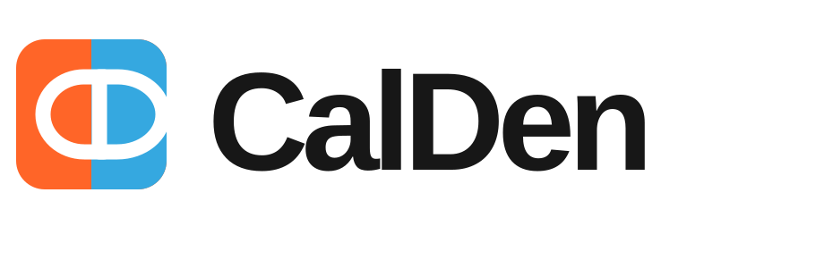

<p align="center">
  
</p>

<h1 align="center">CalDen</h1>

<p align="center"><strong>A family calendar and scheduling system you control.</strong></p>

CalDen is a self-hosted family calendar built for normal people, not calendar administrators. It keeps household schedules in one place, makes it obvious which calendar an event belongs to, and shows exactly who an event is assigned to.

A calendar has its own color. A person has their own identity. The two never compete with each other.

CalDen is currently in active development. The current development build is **0.1.0-alpha1**.

## What CalDen does

CalDen gives a household one shared place to manage schedules without forcing every calendar to be shared with everybody.

You can use it to:

- create separate calendars for things like Family, Bills, School, Work, Appointments, Birthdays, and Vacations
- choose exactly who can see each calendar
- choose exactly who can make changes to each calendar
- assign an event to one or more people
- tell who is responsible for an event by looking at the person's icon
- tell which calendar an event belongs to by looking at the event color
- give people their own sign-in
- use normal Android reminders for personal reminders
- send household-wide reminders through Monita
- use CalDen from a browser on desktop, tablet, or phone
- connect the native CalDen Android app to the same server

## How CalDen is organized

CalDen follows three simple rules:

**Calendar = where the event belongs**

The calendar decides the event color.

**Person = who the event belongs to**

The assigned person's icon or initials appear with the event.

**Reminder = how people are notified**

Personal reminders can stay on the person's phone. Household reminders can be sent through Monita.

For example, a green **Bills** calendar can contain an Internet Bill assigned to Brad and an Electric Bill assigned to Jen. Both events stay green because they belong to Bills, while the person icon shows who is responsible for each one.

## Current features

The current development build includes:

- first-run administrator setup
- multiple user accounts
- administrator, family member, and restricted member account types
- multiple calendars
- calendar colors
- calendar visibility controls
- calendar editing permissions
- multi-person event assignment
- event creation
- event editing
- event deletion
- event notes and locations
- personal Android reminder records
- Monita household reminder records
- Monita connection settings
- Monita test notifications
- background Monita reminder delivery
- reminder delivery retry tracking
- responsive web interface
- native Android client foundation with real server login and event data
- PostgreSQL storage
- automatic database migrations
- Docker deployment
- health checks

CalDen is being developed as a rolling product. Features are being added to the working application rather than held for a future rewrite.

## Quick install with Docker Compose

### 1. Download CalDen

```bash
git clone https://github.com/gigabytegrove/calden.git
cd calden
```

### 2. Create your settings file

```bash
cp .env.example .env
```

Open `.env` and change:

```env
CALDEN_DB_PASSWORD=CHANGE-ME-TO-A-LONG-RANDOM-PASSWORD
```

Use a long random password. You normally do not need to change the other values.

### 3. Start CalDen

```bash
docker compose up -d --build
```

### 4. Open CalDen

By default:

```text
http://YOUR-SERVER-IP:8787
```

The first time CalDen opens, it will ask you to create the first administrator account.

From there you can add family members, create calendars, decide who can see each calendar, and start adding events.

## Docker Compose example

A complete copy-and-run example is included as:

```text
docker-compose.example.yml
```

The repository also includes the normal source deployment file:

```text
compose.yaml
```

For Docker platforms that only accept pasted Compose and do **not** clone the repository, use:

```text
docker-compose.dokploy.yml
```

That version uses the published CalDen container image instead of trying to build from a Dockerfile that is not present.

## Dokploy

CalDen supports both normal Git deployments and Docker Raw deployments in Dokploy.

### Recommended: Git deployment

Point Dokploy at:

```text
https://github.com/gigabytegrove/calden
```

Use the repository Compose file. Because Dokploy has the repository in this mode, `build: .` can see the CalDen Dockerfile and source code.

### Docker Raw deployment

If you create a **Docker Raw** application and paste Compose directly into Dokploy, do not use the source-build Compose file.

Use:

```text
docker-compose.dokploy.yml
```

It uses:

```text
ghcr.io/gigabytegrove/calden:latest
```

and does not require a local Dockerfile.

Set this environment variable in Dokploy before deploying:

```env
CALDEN_DB_PASSWORD=CHANGE-ME-TO-A-LONG-RANDOM-PASSWORD
```

You can optionally change the exposed port:

```env
CALDEN_PORT=8787
```

## Updating

### Source deployment

From the CalDen directory:

```bash
git pull --ff-only
docker compose up -d --build
```

CalDen runs database migrations automatically when the updated container starts.

### Prebuilt image deployment

Pull and recreate the service:

```bash
docker compose pull
docker compose up -d
```

For Dokploy, a normal redeploy performs the same job when the Compose file uses the published image.

## Backups

A complete CalDen backup has two important parts:

- the PostgreSQL database
- the CalDen data volume

The database contains users, calendars, events, permissions, reminders, and settings.

The CalDen data volume contains server-generated application data such as the persistent signing secret.

For a manual PostgreSQL backup:

```bash
docker compose exec -T db pg_dump -U calden -d calden > calden-backup.sql
```

Also back up the Docker volume named:

```text
calden-data
```

and, if you want a full container-level backup, also preserve:

```text
calden-db
```

Do not remove the data volumes during a normal update.

## Monita reminders

CalDen can use Monita for household-wide reminders.

In CalDen:

1. Open **Manage**
2. Find **Monita**
3. Enter the Monita server address
4. Enter the token CalDen should use
5. Choose the default channel
6. Turn on Monita reminders
7. Send a test

An event can then have both:

- a personal phone reminder
- a family reminder through Monita

These are separate on purpose. The person responsible for an event can get a private phone reminder while the rest of the household still receives the system-wide reminder.

If Monita is unavailable when a system reminder is due, CalDen records the failed delivery and retries it instead of taking the calendar offline.

## Android app

The native Android application lives in:

```text
gigabytegrove/calden-android
```

The Android app connects directly to your CalDen server and uses the same users, calendars, events, people assignments, and reminder information as the web interface.

Current Android development includes:

- CalDen server connection
- CalDen login
- upcoming events
- calendar colors
- assigned-person badges
- event creation
- person assignment
- Android notification permission
- local Android reminder scheduling
- CalDen branding

Android development is moving alongside the server so the two stay compatible.

## Ports and storage

The default browser port is:

```text
8787
```

The container itself always listens on port `8787`. `CALDEN_PORT` changes only the host-side port exposed by Docker Compose.

Persistent Docker volumes:

```text
calden-db
calden-data
```

PostgreSQL is not published to the host by default.

## Reverse proxy and HTTPS

If CalDen is exposed outside your home network, put it behind an HTTPS reverse proxy.

Forward the proxy to:

```text
http://CALDEN-SERVER:8787
```

or to whichever host port you selected with `CALDEN_PORT`.

CalDen does not require a special URL path. Hosting it at the root of a hostname is the simplest setup, for example:

```text
https://calendar.example.com
```

## Health check

CalDen exposes:

```text
/api/health
```

A healthy server returns an `ok` response and the running version.

Docker Compose uses this endpoint to confirm that the application is responding.

## Environment settings

Most installations only need to set the database password.

| Setting | Default | Purpose |
| --- | --- | --- |
| `CALDEN_PORT` | `8787` | Port exposed on the Docker host |
| `CALDEN_DB_NAME` | `calden` | PostgreSQL database name |
| `CALDEN_DB_USER` | `calden` | PostgreSQL username |
| `CALDEN_DB_PASSWORD` | none | PostgreSQL password; required by Compose |
| `CALDEN_DB_HOST` | `localhost` outside Compose | Database hostname |
| `CALDEN_DB_PORT` | `5432` | Database port |
| `CALDEN_DB_SSLMODE` | `disable` | Database TLS mode |
| `CALDEN_DATA_DIR` | `/data` in Docker | Persistent application-data location |
| `CALDEN_DATABASE_URL` | unset | Advanced override for the complete PostgreSQL connection string |

If `CALDEN_DATABASE_URL` is supplied, it takes priority over the individual database settings.

## Troubleshooting

### "failed to read dockerfile: open Dockerfile: no such file or directory"

The Compose file was started somewhere that does not contain the CalDen repository.

This commonly happens with Dokploy **Docker Raw** deployments.

Use `docker-compose.dokploy.yml`, or change the Dokploy application to a Git-source deployment.

### CalDen will not start because CALDEN_DB_PASSWORD is missing

Set a database password in `.env` or in your deployment platform:

```env
CALDEN_DB_PASSWORD=a-long-random-password
```

Then redeploy.

### The database is not ready yet

The CalDen container waits for PostgreSQL's health check before starting. On the first launch PostgreSQL may need several seconds to initialize.

Check:

```bash
docker compose ps
docker compose logs db
docker compose logs calden
```

### I changed the browser port and CalDen stopped responding

Do not change the application's internal container port.

Set only:

```env
CALDEN_PORT=YOUR-PORT
```

The Compose file maps that host port to CalDen's internal port `8787`.

## Development status

CalDen is still pre-release software.

The current version is intended for active testing and development. Database migrations are automatic, but backups are strongly recommended before updating between development builds.

Current version:

```text
0.1.0-alpha1
```

## Project layout

```text
calden/
├── cmd/                 CalDen server entry point
├── internal/            Server, storage, reminder, and integration code
├── web/                 CalDen web interface
├── Dockerfile
├── compose.yaml
├── docker-compose.example.yml
└── docker-compose.dokploy.yml
```

## Related repository

CalDen for Android:

```text
https://github.com/gigabytegrove/calden-android
```

## License

CalDen is under active development. The repository's license file governs redistribution and use.
